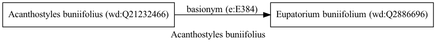

Acanthostyles buniifolius
=========================
  
[iNaturalist taxon id: 803124](https://www.inaturalist.org/taxa/803124)
# Taxonomy in Wikidata
  

# Photos

## by: Anabela Plos
  
  
  
  

## by: Malena Lorente
  
