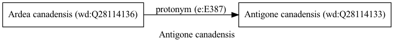

Antigone canadensis
===================
  
[iNaturalist taxon id: 508048](https://www.inaturalist.org/taxa/508048)
# Taxonomy in Wikidata
  

# Photos

## by: Vijay Barve
  
  
  

## by: ncb1221
  
  
  
  
  
  

## by: Dario Taraborelli
  
  
  
  
  
