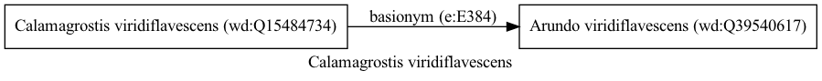

Calamagrostis viridiflavescens
==============================
  
[iNaturalist taxon id: 273959](https://www.inaturalist.org/taxa/273959)
# Taxonomy in Wikidata
  

# Photos

## by: Anabela Plos
  
  
  
