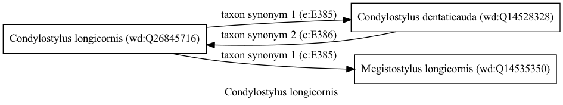

Condylostylus longicornis
=========================
  
[iNaturalist taxon id: 197039](https://www.inaturalist.org/taxa/197039)
# Taxonomy in Wikidata
  

# Photos

## by: Vijay Barve
  

## by: Rodolfo Salinas Villarreal
  
  
  
  

## by: Michael Pirrello
  
  
  
