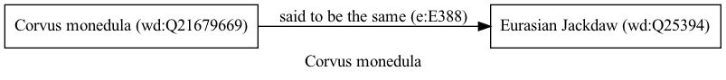

Corvus monedula
===============
  
[iNaturalist taxon id: 8000](https://www.inaturalist.org/taxa/8000)
# Taxonomy in Wikidata
  

# Photos

## by: Andra Waagmeester
  

## by: kitbeard
  

## by: Paul Braun
  

## by: Mohammad Amin Ghaffari
  

## by: Ross Mounce
  
  
