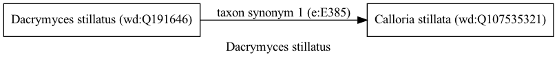

Dacrymyces stillatus
====================
  
[iNaturalist taxon id: 53276](https://www.inaturalist.org/taxa/53276)
# Taxonomy in Wikidata
  

# Photos

## by: Tobias Schönberg
  

## by: kitbeard
  
  
  

## by: Vijay Barve
  
  

## by: Andra Waagmeester
  
  
  
  
  
