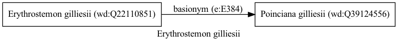

Erythrostemon gilliesii
=======================
  
[iNaturalist taxon id: 1065391](https://www.inaturalist.org/taxa/1065391)
# Taxonomy in Wikidata
  

# Photos

## by: Mohammad Amin Ghaffari
  

## by: Andra Waagmeester
  
  
  

## by: Anabela Plos
  
