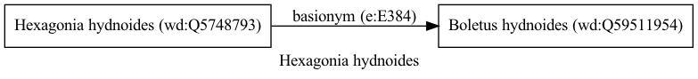

Hexagonia hydnoides
===================
  
[iNaturalist taxon id: 202438](https://www.inaturalist.org/taxa/202438)
# Taxonomy in Wikidata
  

# Photos

## by: Rodolfo Salinas Villarreal
  
  
  
  
  

## by: Tiago Lubiana
  
  
