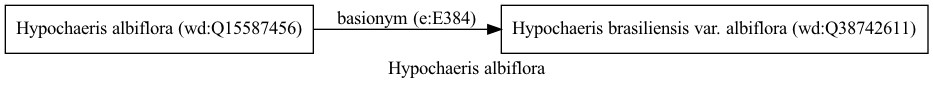

Hypochaeris albiflora
=====================
  
[iNaturalist taxon id: 202635](https://www.inaturalist.org/taxa/202635)
# Taxonomy in Wikidata
  

# Photos

## by: Anabela Plos
  

## by: ncb1221
  
  
  
  
  

## by: Malena Lorente
  
