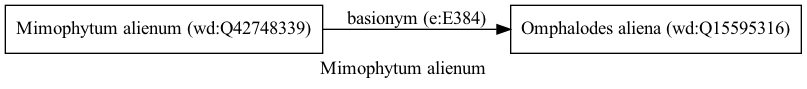

Mimophytum alienum
==================
  
[iNaturalist taxon id: 770443](https://www.inaturalist.org/taxa/770443)
# Taxonomy in Wikidata
  

# Photos

## by: Rodolfo Salinas Villarreal
  
  
  
  
  
  
  
