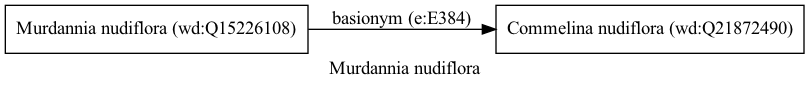

Murdannia nudiflora
===================
  
[iNaturalist taxon id: 165587](https://www.inaturalist.org/taxa/165587)
# Taxonomy in Wikidata
  

# Photos

## by: Vijay Barve
  
  
  
  
  

## by: ncb1221
  
  
  
  
  
  
  
  
  
