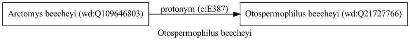

Otospermophilus beecheyi
========================
  
[iNaturalist taxon id: 180007](https://www.inaturalist.org/taxa/180007)
# Taxonomy in Wikidata
  

# Photos

## by: Vijay Barve
  
  

## by: Dario Taraborelli
  
