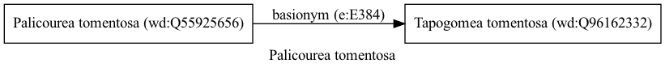

Palicourea tomentosa
====================
  
[iNaturalist taxon id: 1145089](https://www.inaturalist.org/taxa/1145089)
# Taxonomy in Wikidata
  

# Photos

## by: Dario Taraborelli
  
  
  

## by: Tiago Lubiana
  
  
  

## by: Andra Waagmeester
  
  
  
  
