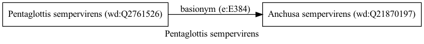

Pentaglottis sempervirens
=========================
  
[iNaturalist taxon id: 166466](https://www.inaturalist.org/taxa/166466)
# Taxonomy in Wikidata
  

# Photos

## by: kitbeard
  
  

## by: Andra Waagmeester
  
  
  

## by: Paul Braun
  
  
