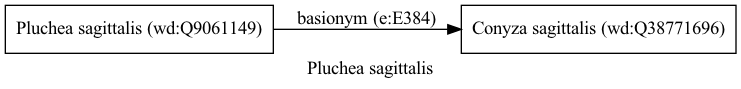

Pluchea sagittalis
==================
  
[iNaturalist taxon id: 167072](https://www.inaturalist.org/taxa/167072)
# Taxonomy in Wikidata
  

# Photos

## by: Malena Lorente
  
  
  

## by: Anabela Plos
  
  
