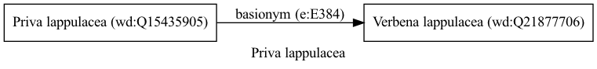

Priva lappulacea
================
  
[iNaturalist taxon id: 51896](https://www.inaturalist.org/taxa/51896)
# Taxonomy in Wikidata
  

# Photos

## by: Andra Waagmeester
  

## by: Rodolfo Salinas Villarreal
  
  
  
  
  
  
