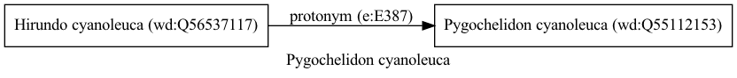

Pygochelidon cyanoleuca
=======================
  
[iNaturalist taxon id: 68826](https://www.inaturalist.org/taxa/68826)
# Taxonomy in Wikidata
  

# Photos

## by: Tiago Lubiana
  
  
  

## by: Andra Waagmeester
  
  
  
  
