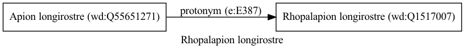

Rhopalapion longirostre
=======================
  
[iNaturalist taxon id: 455182](https://www.inaturalist.org/taxa/455182)
# Taxonomy in Wikidata
  

# Photos

## by: Paul Braun
  
  
  
  
  

## by: Ross Mounce
  
  
  
