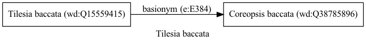

Tilesia baccata
===============
  
[iNaturalist taxon id: 357827](https://www.inaturalist.org/taxa/357827)
# Taxonomy in Wikidata
  

# Photos

## by: Tiago Lubiana
  

## by: Andra Waagmeester
  
  
