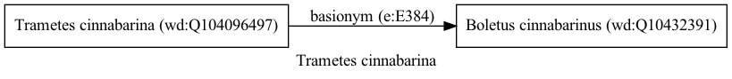

Trametes cinnabarina
====================
  
[iNaturalist taxon id: 974663](https://www.inaturalist.org/taxa/974663)
# Taxonomy in Wikidata
  

# Photos

## by: Michael Pirrello
  
  
  

## by: Andra Waagmeester
  
  
  
  
